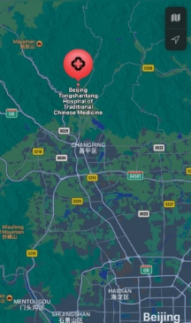



**1. Etymology**

**北京同善堂中医医院**

**北京 - “North Capital”** 

There are traditionally four major historical capitals of China referred to as the "Four Great Ancient Capitals of China". The four are Beijing (North Capital), Nanjing (South Capital), Luoyang (north or sunny ["yang"](https://en.wikipedia.org/wiki/Yin_and_yang#Toponymy "Yin and yang") side of the [Luo River](https://en.wikipedia.org/wiki/Luo_River_\(Henan\) "Luo River (Henan)")) and Xi'an (Western Peace)

The Ming emperors made it their capital in 1421 and it remained China's capital till 1912 when the Manchu Empire fell. In 1949, the city, once again became capital, which it has remained to this day.

**同 - together** 

Together goes back to the Old English togædere, formed by combining the preposition to with gædere, an adverb meaning “together”. Gæd is an Old English word for fellowship or companionship.

**善堂 - The place where people will help you aka hospital** 

The word "hospital" comes from the Latin hospes, signifying a stranger or foreigner, hence a guest. Another noun derived from this, hospitium came to signify hospitality, that is the relation between guest and shelterer, hospitality, friendliness, and hospitable reception.

**中医医院 - Chinese Hospital** 

The word “Chinese Hospital” doesn’t mean the hospital made by Chinese or for Chinese. It simply mean the place where it’s located and some additional practices that are being used that common for Asian region. 

If we combine all the meanings we might get something like: The Chinese hospital in Beijing. 

2. **Location** 

TST Hospital located in a scenic spot near beautiful Thirteen Tombs of the Ming Dynasty. 

The hospital area is located the Wanshou Mountain Range and the Thirteen Lings Reservoir. Near the courtyard there is the natural flowing stream of the mountain spring in the Usuyu scenic area, and behind it is the Doshimat Mountain Coil Road Pavilion where the mountain stands. 

Flowers bloom in all seasons, and you can walk under the forest promenade and drink tea from the mountain spring. The whole courtyard area is covered with more than 90% vegetation, 70% air humidity, oxygen content >21%.

**Outstanding Universal Value - UNESCO Heritage Convention** 

**Brief synthesis**
**

The Imperial Tombs of the Ming and Qing Dynasties were built between 1368 and 1915 AD in Beijing Municipality, Hebei Province, Hubei Province, Jiangsu Province and Liaoning Province of China. They comprise of the Xianling Tombs of the Ming Dynasty and the Eastern and Western Qing Tombs inscribed on the World Heritage List in 2000; the Xiaoling Tomb of the Ming Dynasty and the Ming Tombs in Beijing added to the inscription in 2003, and the Three Imperial Tombs of Shenyang, Liaoning Province (Yongling Tomb, Fuling Tomb, and Zhaoling Tomb, all of the Qing Dynasty) added in 2004.

The Ming and Qing imperial tombs are located in topographical settings carefully chosen according to principles of geomancy (Fengshui) and comprise numerous buildings of traditional architectural design and decoration. The tombs and buildings are laid out according to Chinese hierarchical rules and incorporate sacred ways lined with stone monuments and sculptures designed to accommodate ongoing royal ceremonies as well as the passage of the spirits of the dead. They illustrate the great importance attached by the Ming and Qing rulers over five centuries to the building of imposing mausolea, reflecting not only the general belief in an afterlife but also an affirmation of authority.

The tomb of the first Ming Emperor, the Xiaoling Tomb broke with the past and established the basic design for those that followed in Beijing, and also the Xianling Tomb of the Ming Dynasty in Zhongxiang, the Western Qing Tombs and the Eastern Qing Tombs. The Three Imperial Tombs of the Qing Dynasty in Liaoning Province (Yongling Tomb, Fuling Tomb, and Zhaoling Tomb) were all built in the 17th century for the founding emperors of the Qing Dynasty and their ancestors, integrating the tradition inherited from previous dynasties with new features from the Manchu civilization.

The Imperial Tombs of the Ming and Qing Dynasties are masterpieces of human creative genius by reason of their organic integration into nature, and a unique testimony to the cultural and architectural traditions of the last two feudal dynasties (Ming and Qing) in the history of China between the 14th and 20th centuries. They are fine works combining the architectural arts of the Han and Manchu civilizations. Their siting, planning and design reflect both the philosophical idea of “harmony between man and nature” according to Fengshui principles and the rules of social hierarchy, and illustrate the conception of the world and power prevalent in the later period of the ancient society of China.

**Climate in Beijing** 

Though Beijing is a relatively short distance from the sea, the general air circulation in the region is mainly from the northwest throughout the year; maritime effects on the region’s [weather](https://www.britannica.com/science/weather) are meagre. The [climate](https://www.britannica.com/science/climate-meteorology) is clearly of the continental [monsoon](https://www.britannica.com/science/monsoon) type that occurs in the temperate zone. Local [topography](https://www.merriam-webster.com/dictionary/topography) also has a great effect on Beijing’s climate. Because it lies in a lowland area and is protected by mountains, the city is a little warmer in [winter](https://www.britannica.com/science/winter) than other areas of China located at the same latitude; nonetheless, the mean monthly temperature drops below 50 °F (10 °C) for five months out of the year. In addition, wind direction in Beijing is influenced by topography, with changes occurring from day to night. Generally, there are more southerly [winds](https://www.britannica.com/science/wind) in the day but northerly or northwesterly winds at night.

The annual mean temperature of the city is 53 °F (12 °C). The coldest month is January, when the monthly mean is 24 °F (–4 °C), and the warmest month is July, when it is 79 °F (26 °C). In an average year, the city experiences 132 days of freezing temperatures between October and March; the mean annual [precipitation](https://www.britannica.com/science/precipitation) is 25 inches (635 mm), with most of the total falling from June to August. July is ordinarily the wettest month of the year, with an average of 9 inches (230 mm).

One of the [characteristics](https://www.britannica.com/dictionary/characteristics) of the region’s precipitation is its variability. In 1959—an extremely wet year for Beijing—the total precipitation amounted to 55 inches (1,400 mm), whereas in 1891—an extremely dry year—only 7 inches (180 mm) fell. The average number of rainy days per year is about 80, and the average [relative humidity](https://www.britannica.com/science/relative-humidity) for the city is 57 percent.

Winter in Beijing is long and usually begins in late October, when northwesterly winds gradually gain strength. This seasonal [wind system](https://www.britannica.com/science/wind) dominates the region until March; the Siberian air that passes southward over the [Mongolian Plateau](https://www.britannica.com/place/Mongolian-Plateau) and into China proper is cold and dry, bringing little snow or other precipitation. The monthly mean [temperature](https://www.britannica.com/science/temperature) from December to February is below freezing. [Spring](https://www.britannica.com/science/spring-season), the windiest season, is short and rapidly becomes warm. The prevailing high spring winds produce an evaporation rate that averages about nine times the total precipitation for the period and frequently is sufficient to cause [droughts](https://www.britannica.com/science/drought) that are harmful to agriculture. Dust storms in the region, [exacerbated](https://www.merriam-webster.com/dictionary/exacerbated) by increasing desertification in [Inner Mongolia](https://www.britannica.com/place/Inner-Mongolia), are common in April and May. In addition to being the season of torrential rains, [summer](https://www.britannica.com/science/summer-season) is rather hot, as warm and humid air from the southeast often penetrates into North China. [Autumn](https://www.britannica.com/science/autumn-season) begins in late September and is a pleasant, though short, season with clear skies and comfortable temperatures.

